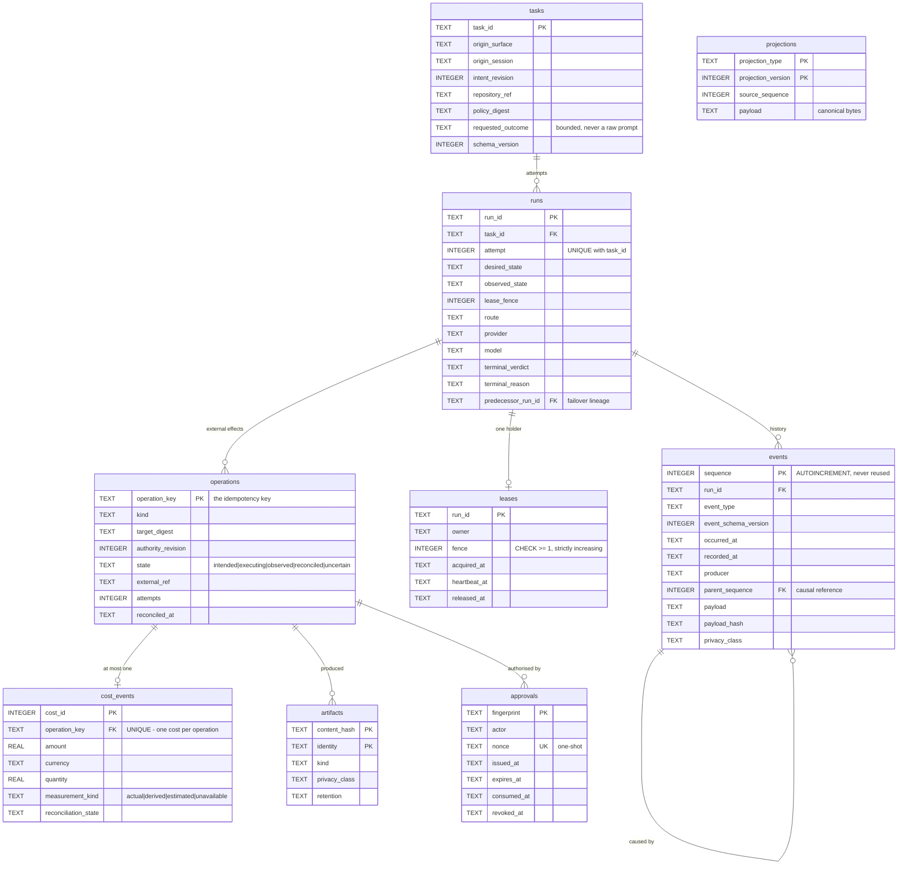

# Runtime journal schema (#613)

Companion to [the ADR](runtime-journal.md). This is the schema diagram #613
requires as evidence, plus the reasoning behind the constraints that are doing
real work — the ones a reader would otherwise be tempted to relax.

## Shape

## Constraints that are load-bearing

Each of these exists because the obvious alternative fails in a specific way,
and each is covered by a test that fails if it is relaxed.

| Constraint | What it prevents |
|---|---|
| `events.sequence` is `AUTOINCREMENT` | `MAX(seq)+1` **reuses** a sequence after a delete, making two different events indistinguishable in replay |
| `UNIQUE (runs.task_id, attempt)` | two rows claiming to be the same attempt of one task |
| `UNIQUE (cost_events.operation_key)` | double-charging. A duplicate becomes an insert failure, not an audit finding months later |
| `CHECK (leases.fence >= 1)` | a zero or negative fence, which would compare as "older than everything" and let any writer through |
| `PRIMARY KEY (artifacts.content_hash, identity)` | the same artifact recorded twice for one run, inflating evidence counts |
| `approvals.nonce UNIQUE` | an approval replayed to authorise a second operation |
| `PRAGMA foreign_keys=ON` | an orphan cost, or evidence attributed to a run that does not exist |

The `UNIQUE (task_id, attempt)` row has already earned its place: `record_admission`
originally hardcoded `attempt=1`, so a task's *second* run violated it — and
because admission is best-effort, the violation was swallowed and the run went
unjournalled in silence. The constraint is what made that findable.

## What is deliberately not here

- **Raw prompts.** `tasks.requested_outcome` is a bounded one-line summary.
  #613's non-goals rule out storing chain-of-thought or raw private code to
  make replay possible, and an unbounded field would quietly become one.
- **Provider responses.** Same reason. `artifacts` records a content hash and a
  privacy class, not the content.
- **Secrets.** `privacy_class` includes `secret_reference` precisely so a row
  can point at a credential without containing one.

## Migration

One append-only list in `journal_store._MIGRATIONS`, applied in order, each
inside its own transaction that also records the resulting version. An
interruption therefore leaves a version that was *fully* applied, never half of
one — proven by the fault-injection suite, which kills a migration partway and
then reopens successfully.

Editing a shipped migration is forbidden: it would leave already-migrated
databases silently different from fresh ones.
