# PR #817 — Settings redesign, independent screenshot evidence

Captured 2026-09-10 by booting the real web UI (`opai/assets/web/index.html`) through the
repository's own e2e mock bridge and deterministic fixtures — the same harness the
committed Playwright gallery uses.

| | |
| --- | --- |
| **BEFORE** | `ab4e26e` — the merge base PR #817 targets |
| **AFTER** | `807a067` — PR #817 head |
| Viewports | desktop 1440x900 · tablet 768x1024 · phone 390x844 |
| Browser | Chromium (Playwright), `prefers-reduced-motion: reduce`, animations disabled |

These are **not** the PR author's committed baselines. They were re-rendered from source on
both branches so the two sides are directly comparable.

---

## 1. The change in one image — desktop information architecture

11 destinations with an Overview dashboard become 7 task-oriented destinations that open at
General. Search moves from a bar over the content into the rail.

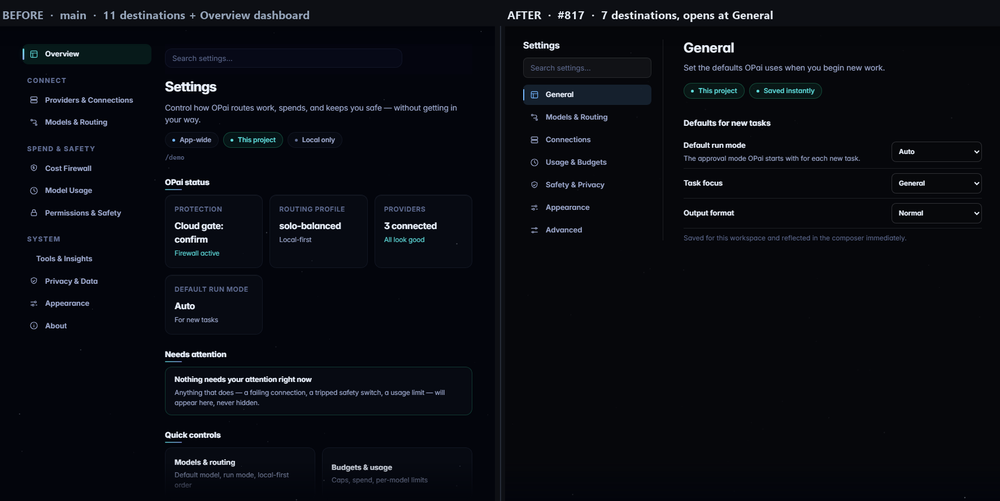

---

## 2. Phone — the strongest argument for the redesign

Before, the destination rail wrapped into a multi-column block and the group labels
(`CONNECT`, `SPEND & SAFETY`, `SYSTEM`) collided with the items beside them. After, the
phone gets a proper index/detail flow with subtitles and chevrons.

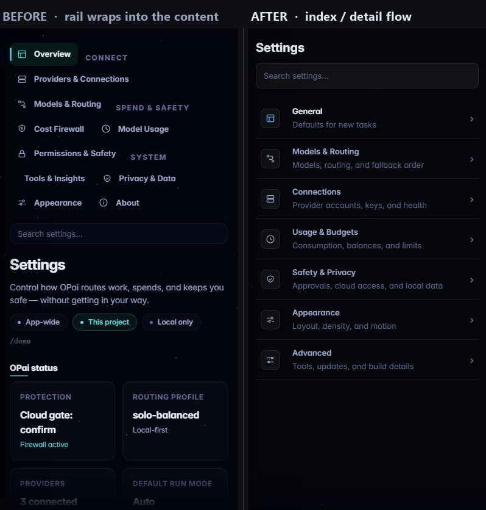

---

## 3. Page-by-page: where each old page went

### Cost Firewall → Usage & Budgets

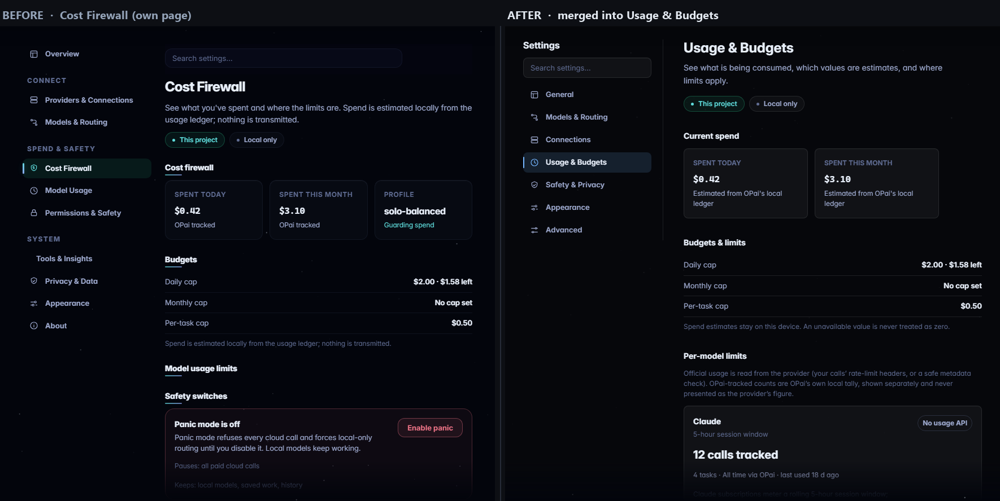

### Permissions & Safety → Safety & Privacy

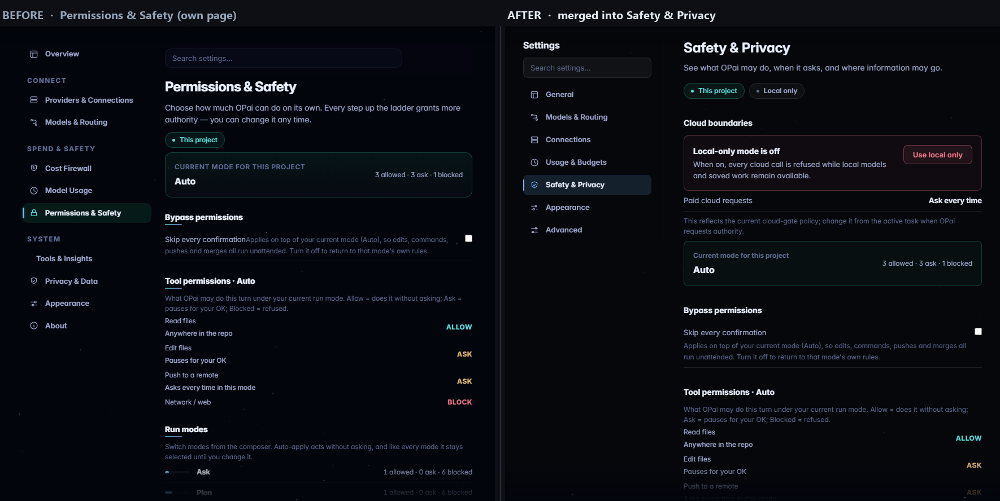

### Providers & Connections → Connections

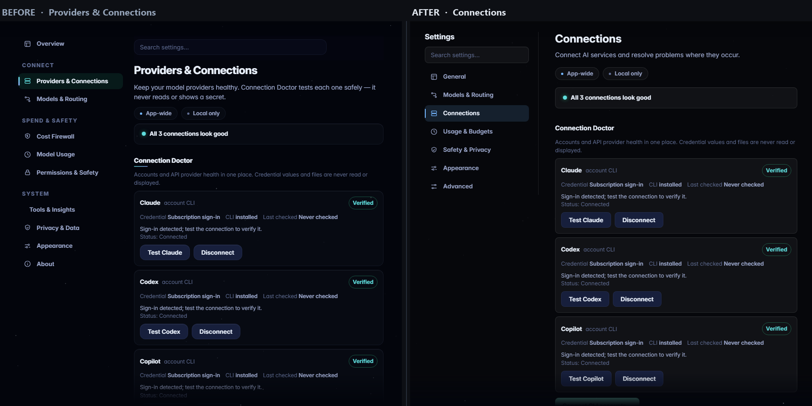

### Tools & Insights + About → Advanced

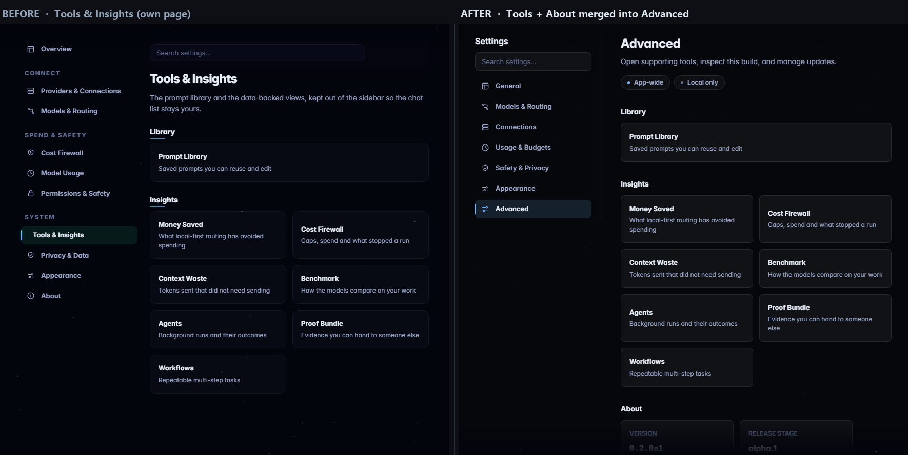

---

## 4. All seven new desktop destinations

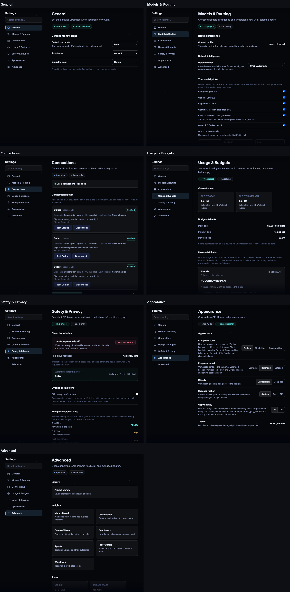

---

## 5. Tablet — horizontal destination strip

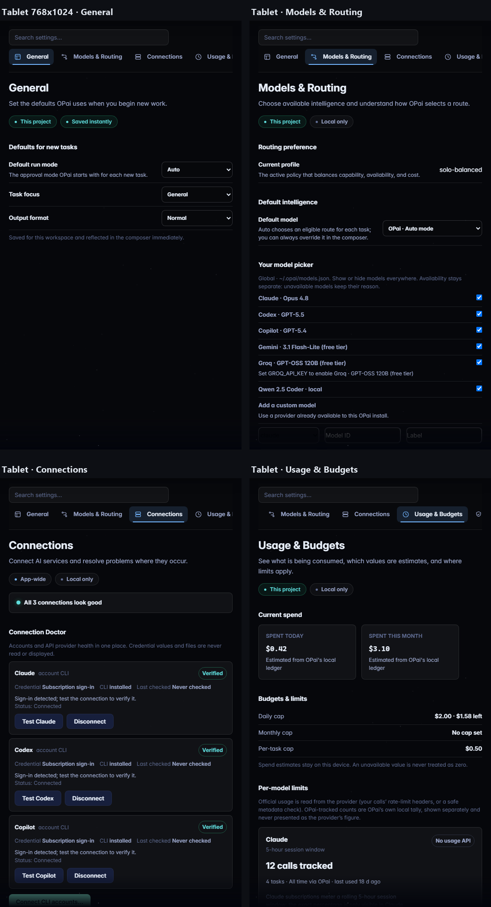

---

## 6. Phone — index and detail pages

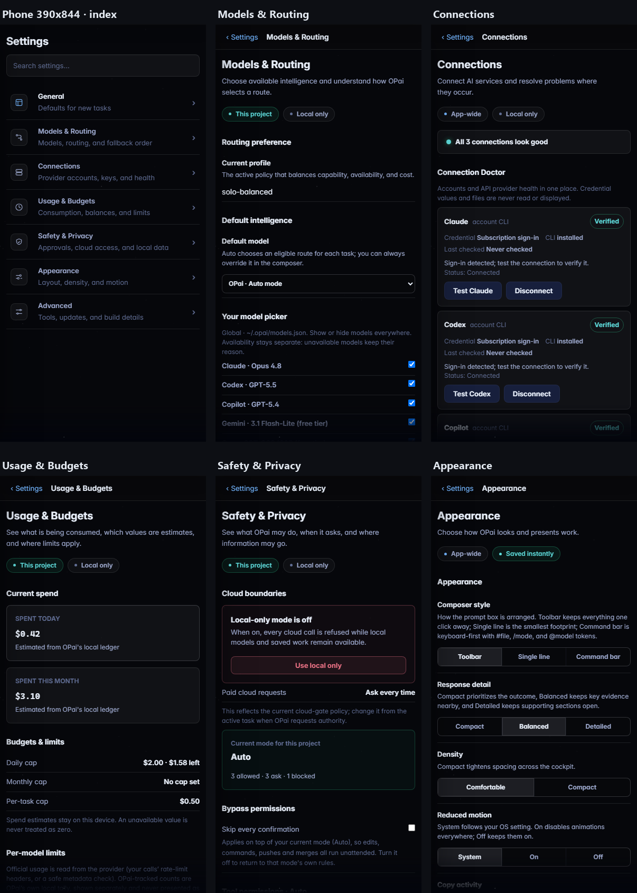

---

## 7. Global search

Results carry a `Destination › subsection` breadcrumb, and there is an explicit
clear control and an explicit no-results state.

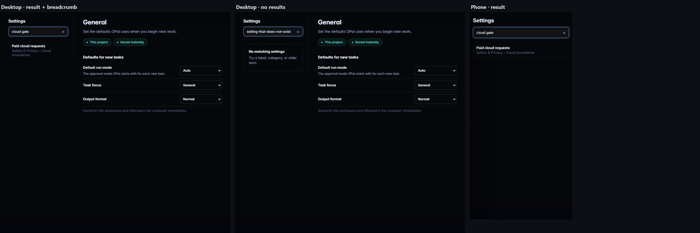

---

## 8. High-information states

Failure, budget pressure, a blocked permission and a pending update all stay visible.

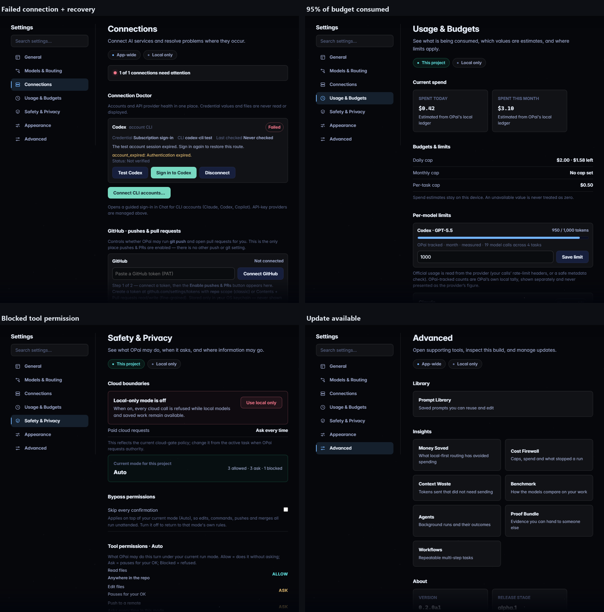

---

## 9. Finding — two stale visual baselines

`opai/assets/web/__tests__/e2e/design-tokens.spec.js-snapshots/{comfortable,compact}-settings.png`
were last refreshed in the PR's **first** commit `1af03bb`, which still shipped the
10-destination IA. The **second** commit `807a067` collapsed the IA to 7 destinations and
did not refresh them, so they now encode a UI that no longer exists.

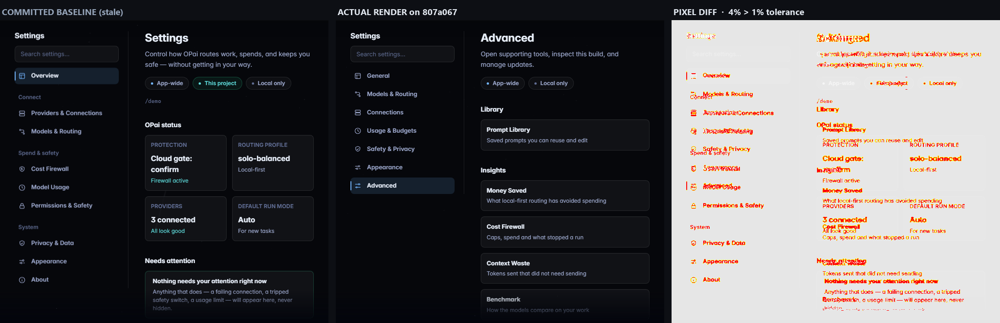

```
npx playwright test design-tokens

  on 807a067 (PR head):   2 failed, 2 passed
      18742 pixels (ratio 0.04 of all image pixels) are different   # compact
      18978 pixels (ratio 0.05 of all image pixels) are different   # comfortable
      tolerance: maxDiffPixelRatio 0.01

  on ab4e26e (merge base): 4 passed
```

The left pane above is the PR's own committed baseline (`git hash-object` →
`8130c41a9a25e91fc618aef0feb1a334df1ff6b1`, byte-identical to the `-expected.png` the
failing run used). It shows `Overview / Connect / Spend & safety / System` and the
`OPai status` + `Needs attention` dashboard — the pre-second-pass UI.

Note for whoever refreshes these: the `Settings` frame in `design-tokens.spec.js` does not
capture the Settings landing page. `openNav()` reaches *Prompt Library* and *Money Saved*
**through** Settings → Advanced, and Settings restores its last-visited destination, so the
frame lands on **Advanced**. That is pre-existing — `ab4e26e` behaves the same way and parks
on `tools` — but it means the refreshed baseline will encode Advanced, not General.
