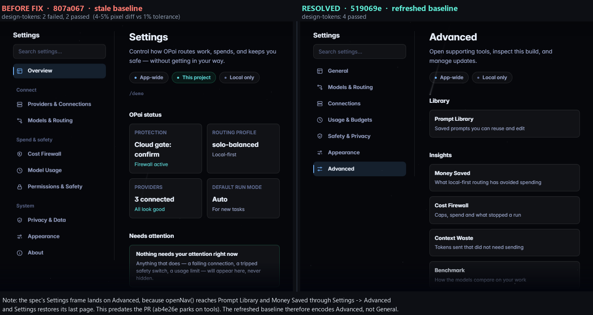

# PR #817 — Settings redesign, independent screenshot evidence

**Re-captured 2026-09-13** against the current PR head. Every image was rendered live by
booting the real web UI (`opai/assets/web/index.html`) through the repository's own e2e mock
bridge and deterministic fixtures, on both sides of the change.

| | |
| --- | --- |
| **BEFORE** | `ab4e26e` — the merge base PR #817 targets, and still the tip of `main` |
| **AFTER** | `519069e` — PR #817 head |
| Viewports | desktop 1440x900 · tablet 768x1024 · phone 390x844 |
| Browser | Chromium (Playwright), `prefers-reduced-motion: reduce`, animations disabled |

These are **not** the PR author's committed baselines. This branch holds images and this page
only. It contains no code and is not for merge. The first capture (2026-09-10, AFTER =
`807a067`) remains in this branch's history at `f29750d`.

---

## What changed since the first capture

| | |
| --- | --- |
| New commits | **One**: `519069e` *test(web): refresh Settings token baselines* (Carlson29) |
| Files it touches | Two baseline PNGs in `design-tokens.spec.js-snapshots/`. No code. |
| UI source | `settings.js`, `styles.css` and `app.js` are identical to `807a067` |
| `main` | Unmoved; still `ab4e26e` |
| Pixel comparison | All 38 re-captures were compared with the 2026-09-10 captures. **No control, text or layout pixel differs.** The only differences are the randomized starfield background (0.04–0.13% of pixels per image, scattered dots) and one live "resets in …" countdown on the BEFORE usage page. |

So the screenshots below show the same interface as before, freshly rendered. The one
substantive change is the blocking finding in section 9, which is now **resolved**.

---

## 1. The change in one image — desktop information architecture

11 destinations with an Overview dashboard become 7 task-oriented destinations that open at
General. Search moves from a bar over the content into the rail.


---

## 2. Phone — the strongest argument for the redesign

Before, the destination rail wrapped into a multi-column block and the group labels
(`CONNECT`, `SPEND & SAFETY`, `SYSTEM`) collided with the items beside them. After, the
phone gets a proper index/detail flow with subtitles and chevrons.


---

## 3. Page-by-page: where each old page went

### Cost Firewall → Usage & Budgets


### Permissions & Safety → Safety & Privacy


### Providers & Connections → Connections


### Tools & Insights + About → Advanced


---

## 4. All seven new desktop destinations


---

## 5. Tablet — horizontal destination strip


---

## 6. Phone — index and detail pages


---

## 7. Global search

Results carry a `Destination › subsection` breadcrumb, and there is an explicit clear
control and an explicit no-results state.


---

## 8. High-information states

Failure, budget pressure, a blocked permission and a pending update all stay visible.


---

## 9. ✅ Resolved — the two stale design-token baselines

On `807a067`, `design-tokens.spec.js-snapshots/{comfortable,compact}-settings.png` still
encoded the pre-redesign Settings UI. The spec failed 2 of 4 with a 4–5% pixel diff against a
1% tolerance, while the merge base passed 4 of 4.

`519069e` refreshed both files, and the spec now passes:

```
npx playwright test design-tokens

  807a067  ->  2 failed, 2 passed    (committed baseline 8130c41a…)
  519069e  ->  4 passed              (committed baseline c219ca97…)
```



**Note, not blocking.** The refreshed `Settings` frame shows **Advanced**, not the Settings
landing page. `openNav()` reaches *Prompt Library* and *Money Saved* **through** Settings →
Advanced, and Settings restores its last-visited destination, so that is where the frame
lands. The behaviour predates this PR (`ab4e26e` parks on `tools`). The token check is valid;
it just samples Advanced rather than General.
