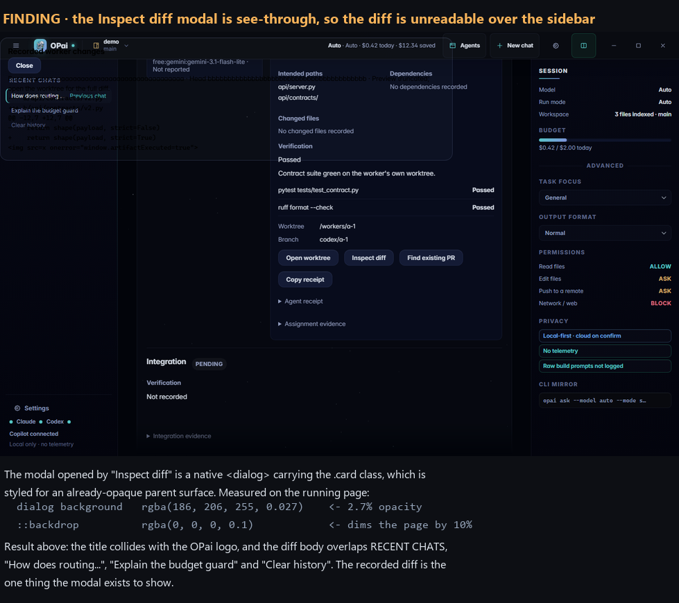
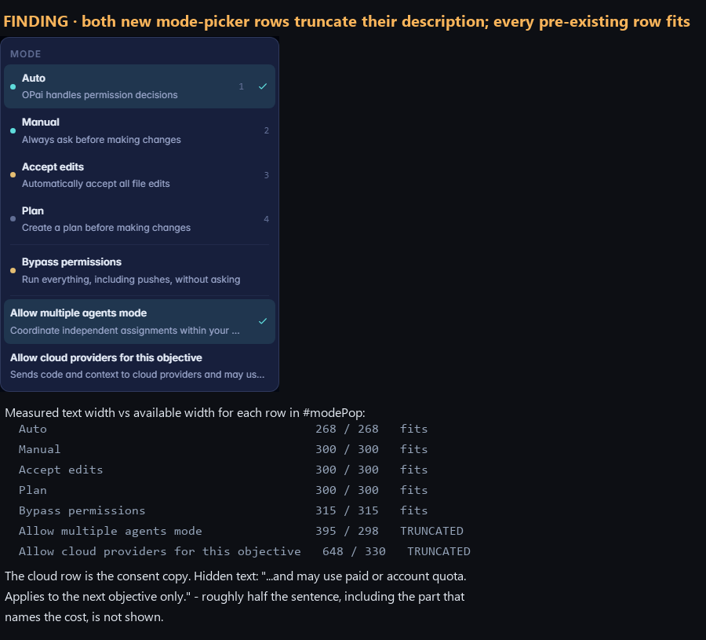
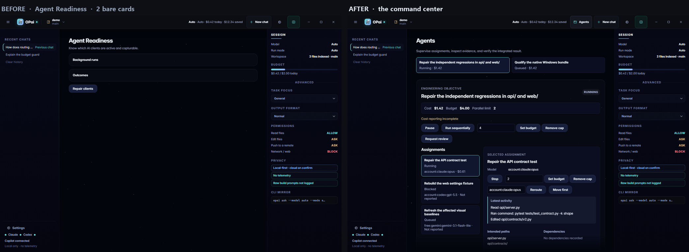
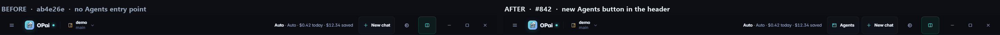
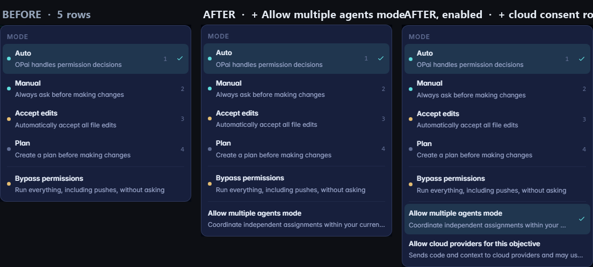
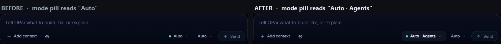
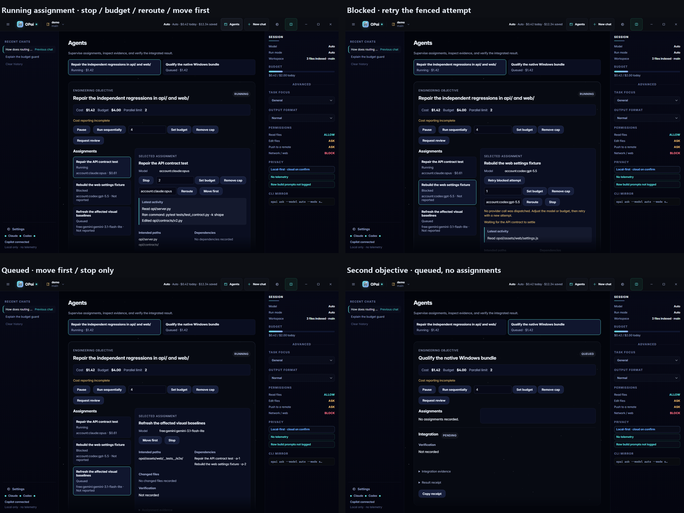
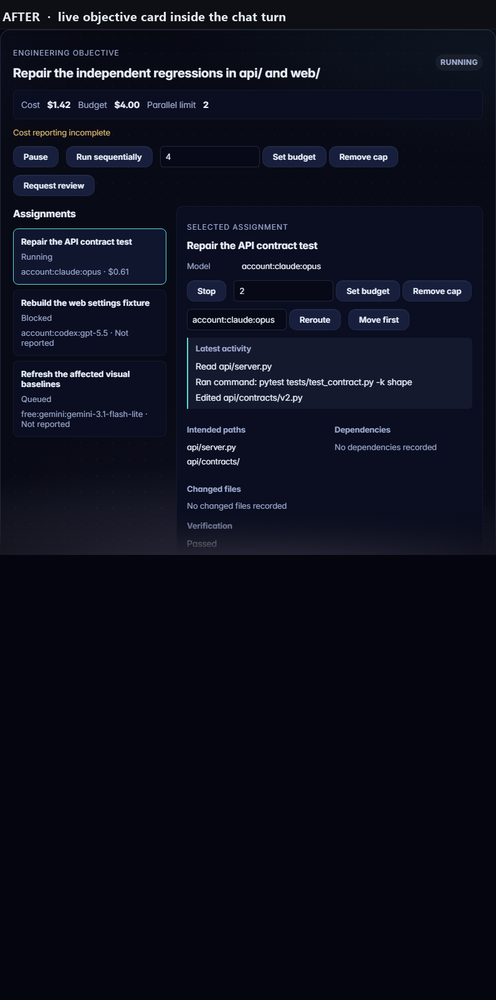

# PR #842 — Agents command center, screenshot evidence

Captured by booting the real web UI (`opai/assets/web/index.html`) through the repository's
own e2e mock bridge and deterministic fixtures, on both sides of the change.

| | |
| --- | --- |
| **BEFORE** | `ab4e26e` — the merge base PR #842 targets |
| **AFTER** | `74a3d49` — PR #842 head |
| Viewport | 1440x900 (1440x1000 for full-page captures) |
| Browser | Chromium (Playwright), `prefers-reduced-motion: reduce`, animations disabled |

This branch holds images and this page only. It contains no code and is not for merge.

---

## Findings

### 1. The "Inspect diff" modal is see-through

### 2. Both new mode-picker rows truncate their description

---

## Before and after

### Agents view

### Header

### Mode picker

### Mode pill

### Assignment and objective states

### Live objective card in chat

