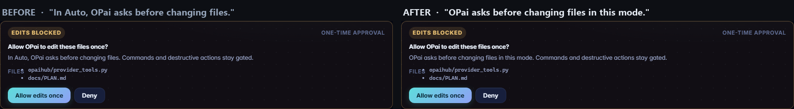
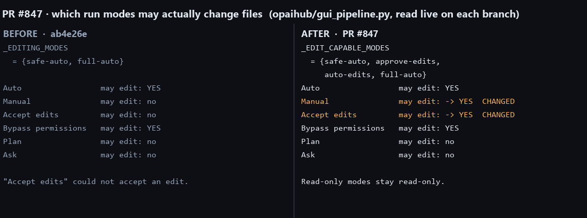

# PR #847 — canonical runtime journal, screenshot evidence

| | |
| --- | --- |
| **BEFORE** | `ab4e26e` — the merge base PR #847 targets |
| **AFTER** | `305331c` — PR #847 head |

This branch holds images and this page only. It contains no code and is not for merge.

PR #847 is almost entirely backend. Its whole web-UI diff is two lines in
`opai/assets/web/app.js`, so this gallery is short on purpose.

---

## The one visible change: edit-approval card copy

Rendered through the repository's own e2e mock bridge on both branches, in Manual mode.

## Why the copy changed: which run modes may edit

Read live from `opaihub/gui_pipeline.py` on each branch, not inferred from the diff.

